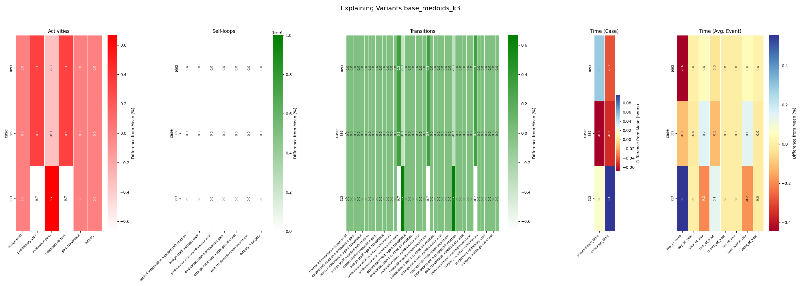

# XAI4TraceVariant

**Explainable AI for Understanding Process Mining Trace Variants**

A white-box framework that explains why process execution traces behave differently, without relying on black-box machine learning models.

## The Core Technique

**XAI4TraceVariant** transforms event logs into interpretable insights through a systematic 4-stage pipeline:

1. **Profile** traces into multi-dimensional feature vectors
2. **Construct** similarity graphs connecting comparable traces  
3. **Detect** communities to identify variant groups
4. **Explain** differences through human-interpretable visualizations

### Why This Matters

Traditional process mining tools help you *discover* what processes look like, but not *why* they vary. XAI4TraceVariant bridges that gap:

- **Interpretability First**: No neural networks, no black boxes—explanations are always traceable to original trace data
- **Actionable Insights**: Visual heatmaps highlight specific activities, transitions, and timing that differ
- **Domain Expert Ready**: Designed for process analysts, not data scientists

### Key Features

- **Multi-dimensional profiling**: Activities (one-hot encoded), transition patterns (directly-follows graphs), temporal statistics
- **Weighted k-NN graphs**: Find similar traces using customizable distance metrics
- **Community detection**: Apply Louvain algorithm to automatically identify variant groups
- **Segmented explanations**: Visual breakdowns of activity differences, loop behavior, timing, and more
- **Multiple input formats**: XES, OCEL (SQLite/JSON), and dataframe inputs

## Architecture

### 1. Trace Profiling — `EL2GraphTime.profile()`

Extracts three types of features from each trace:

| Feature Type | What It Captures | Example |
|---|---|---|
| **Activities** | Which events occur | One-hot: `[1, 0, 1, 1, 0, ...]` (did A, C, D happen?) |
| **Transitions** | Order dependencies | DFG matrix: A→B=2, B→C=1, ... |
| **Time** | Duration, gaps, frequency | Avg event gap, case duration, hourly patterns |

**Input**: XES log or OCEL (event ID, activity, timestamp per row)  
**Output**: CSV matrix where each row is a trace and each column is a feature

### 2. Similarity Graphs — `EL2GraphTime.extract_knn_graph()`

Builds a k-NN network:

```
Distance = w_act × Levenshtein(activity_seq_i, activity_seq_j)
         + w_tra × Levenshtein(transition_seq_i, transition_seq_j)
         + w_time × Euclidean(temporal_stats_i, temporal_stats_j)
```

- Connect each trace to its k nearest neighbors
- Weights balance different feature importance
- Result: GraphML file with traces as nodes, similarity as edges

### 3. Variant Detection — `community_louvain.best_partition()`

Apply Louvain community detection to find groups of similar traces:

- Maximize modularity to identify natural cluster boundaries
- Compute centrality measures (degree, betweenness, closeness, PageRank)
- Select representative traces per community based on different metrics
- **Output**: CSV with trace IDs, community assignments, and centrality scores

### 4. Visual Explanations — `ELExplainer.explain_variants()`

Generate interpretable visualizations:

| Explanation Type | Use Case |
|---|---|
| **Global** | "How do communities differ from the population mean?" |
| **Local** | "How does this trace differ from that one?" |

Both use **segmented heatmaps**:
- Red/green for activity presence/absence
- Color intensity shows deviation from mean
- Separate sections for activities, transitions, and time

## Installation

### Requirements

- Python 3.8+
- Dependencies listed in `requirements.txt`

### Setup

```bash
# Clone the repository
git clone <repository-url>
cd xai4tracevariant

# Create a virtual environment (recommended)
python -m venv venv
source venv/bin/activate  # On Windows: venv\Scripts\activate

# Install dependencies
pip install -r requirements.txt
```

### Key Dependencies

- **pm4py**: Process mining library for log analysis
- **networkx**: Graph algorithms and visualization
- **scikit-learn**: Machine learning utilities (k-NN, vectorization)
- **python-louvain**: Community detection
- **matplotlib & seaborn**: Visualization
- **pandas & numpy**: Data manipulation
- **Levenshtein**: Edit distance computation
- **datasketch**: MinHash sketches for efficient similarity

## Example Visualization

Below is an example of the **global explanation heatmap** generated by XAI4TraceVariant, showing how trace variants differ across multiple dimensions:



**What you're seeing:**

- **Activities (Left)**: Red/white heatmap showing which activities are overrepresented (red) or underrepresented (white) in each variant
- **Self-loops (Second)**: Green heatmap indicating activities that repeat within traces (self-transitions like A→A)
- **Transitions (Center)**: Large green grid showing transition patterns (A→B, B→C, etc.) and their deviations from the mean
- **Time (Right)**: Blue/red/yellow heatmap showing temporal differences (duration, gaps, event frequency)

Each row is a **representative trace** from a variant group, and each column is a feature. The color intensity shows how much that variant deviates from the population mean. This allows domain experts to spot differences without opening a black box.

---

## Quick Start

### 1. Load & Profile Your Event Log

```python
from EL2GraphTime import EL2GraphTime

config = {
    'encoding': 'onehot',
    'aggregation': 'average',
    'embed_from': 'nodes',
    'edge_operator': 'average'
}

profiler = EL2GraphTime(
    ocel_path='./data/mylog.sqlite',
    ocel_case_notion='orders',    # Case type in your OCEL
    config=config,
    k=3,                          # Number of neighbors for k-NN graph
    just_profile=False
)
```

**Supports**:
- **XES**: Standard process mining format (`.xes`)
- **OCEL SQLite**: `pm4py.read_ocel_sqlite()` and `pm4py.read_ocel2_sqlite()`
- **OCEL JSON**: `pm4py.read_ocel2_json()`

**Outputs**:
- `./results/{name}_profiled.csv` — Feature matrix
- `./results/{name}_k{k}_wa{w}_wt{w}_wtime{w}.graphml` — Similarity graph

### 2. Detect Communities & Find Representatives

```python
import networkx as nx
from community import community_louvain
import pandas as pd

# Load the graph
G = nx.read_graphml('./results/mylog_k3_wa1_wt1_wtime0.5.graphml')

# Detect communities
partition = community_louvain.best_partition(G)

# Compute centrality measures
degree_centrality = nx.degree_centrality(G)
betweenness = nx.betweenness_centrality(G)
pagerank = nx.pagerank(G)

# Build representative table
representatives = {}
for comm_id in set(partition.values()):
    nodes = [n for n, c in partition.items() if c == comm_id]
    reps = {
        'community': comm_id,
        'degree_rep': max(nodes, key=lambda n: degree_centrality[n]),
        'betweenness_rep': max(nodes, key=lambda n: betweenness[n]),
        'pagerank_rep': max(nodes, key=lambda n: pagerank[n])
    }
    representatives[comm_id] = reps

pd.DataFrame(representatives).T.to_csv('./community_results/mylog_representatives.csv')
```

### 3. Generate Explanations

```python
from ELExplainer import ELExplainer

explainer = ELExplainer(
    profile_df_path='./results/mylog_profiled.csv',
    representatives_df_path='./community_results/mylog_representatives.csv',
    metric='degree_rep',  # Which representative to use
    graph_based=True
)

# Show how communities differ from the population mean
explainer.explain_variants()  # Saves to ./results_img/...

# Compare two specific traces
explainer.local_explanation(case='trace_123', variant_case='trace_456')
```

### Example Datasets

The `adbis_datasets/` folder includes benchmarks:

- **base.sqlite**: Baseline synthetic process
- **fullchange.sqlite**: Variants with structural changes
- **tratime.sqlite**: Variants with temporal differences
- **wabo.xes**: Real-world event log

## Output Files

```
./results/
  ├── {name}_profiled.csv
  └── {name}_k3_wa1_wt1_wtime0.5.graphml

./community_results/
  ├── {name}_modularity0.85_r1.0.csv           # Nodes + centrality
  └── {name}_numcom12_r1.0_representative.csv  # Representative traces

./results_img/
  ├── {name}_explanation.png          # Global variant comparison
  └── {name}_local_explanation.png    # Pairwise comparison
```

## API Reference

### `EL2GraphTime` — Profiling & Graph Construction

```python
EL2GraphTime(
    ocel_path: str,              # Path to event log (XES/OCEL/SQLite)
    ocel_case_notion: str,       # Case type in OCEL (e.g., "orders")
    config: dict,                # Feature extraction config
    k: int = 3,                  # Number of k-NN neighbors
    just_profile: bool = False,  # Stop after profiling?
    plot: bool = False
)
```

**Methods**:
- `compute_distance_matrix()` — Compute pairwise distances
- `extract_knn_graph()` — Build similarity graph
- `get_trace_transition_matrix()` — Extract DFG per trace
- `run_onehot()` — One-hot encode activities

### `ELExplainer` — Visualization

```python
ELExplainer(
    profile_df_path: str,              # Path to feature CSV
    representatives_df_path: str,      # Path to representatives CSV
    metric: str = 'degree_rep',        # Representative metric
    graph_based: bool = True
)
```

**Methods**:
- `explain_variants()` — Global comparison heatmap
- `local_explanation(case, variant_case)` — Pairwise comparison
- `plot_explanation()` — Render heatmap to image

## Published Work

**Explaining Process Model Variants through Explainable AI**

This framework is the implementation of research presented in:

> Published in *Advances in Databases and Information Systems (ADBIS 2025)*  
> DOI: [10.1007/978-3-032-05281-0_7](https://link.springer.com/chapter/10.1007/978-3-032-05281-0_7)

### Reproducing the Paper

For step-by-step instructions to reproduce the ADBIS 2025 experiments, see [experiments/adbis25/README.md](experiments/adbis25/README.md):

```bash
cd experiments/adbis25
cat README.md
```

The reproducibility scripts include:
- Full pipeline from raw log to explanations
- Community detection with centrality analysis
- Custom k-means clustering alternative
- Clustering quality metrics (Silhouette, Davies-Bouldin, Calinski-Harabasz)

## Implementation Notes

### Performance

- **Trace Profiling**: O(n·m) where n = traces, m = events per trace
- **Distance Computation**: O(n²) — scales as the square of trace count
  - Parallelized using multiprocessing (uses ~half of available CPUs)
  - For logs > 10K traces, consider subsampling or using clustering instead
- **Community Detection**: O(n²) for Louvain modularity optimization
- **Visualization**: Heatmaps handle 100+ rows efficiently

### Key Design Choices

| Choice | Reason |
|--------|--------|
| **Edit distance for sequences** | Activities and transitions are sequences; Levenshtein distance respects order |
| **Euclidean for temporal stats** | Time features are continuous; Euclidean distance is standard |
| **Louvain community detection** | Proven efficient algorithm; no need to specify # communities a priori |
| **k-NN graphs over full graphs** | Reduces noise, focuses on nearest neighbors (most similar traces) |
| **Heatmaps over other viz** | Shows both positive and negative deviations; easy to read at scale |

## Contributing

Contributions are welcome! Areas of interest:

- New distance metrics (e.g., time-aware edit distance)
- Alternative community detection algorithms
- Performance optimizations for large logs
- Additional visualization types
- Benchmark datasets

Please open an issue or submit a pull request.

## Citation

If you use XAI4TraceVariant in your research, please cite:

```bibtex
@inproceedings{barbon2025explaining,
  title={Explaining Process Model Variants through Explainable AI},
  booktitle={Advances in Databases and Information Systems},
  pages={XX--XX},
  year={2025},
  publisher={Springer}
}
```

## License

This project is licensed under the MIT License.

## Acknowledgments

- [pm4py](https://pm4py.fit.fraunhofer.de/) — Process mining library
- [NetworkX](https://networkx.org/) — Graph algorithms
- [python-louvain](https://github.com/taynaud/python-louvain) — Community detection
- [Levenshtein](https://github.com/ztane/python-Levenshtein) — Edit distance
- [scikit-learn](https://scikit-learn.org/) — Machine learning utilities

---

**Making process mining interpretable.** Learn why traces behave differently without sacrificing explainability.
